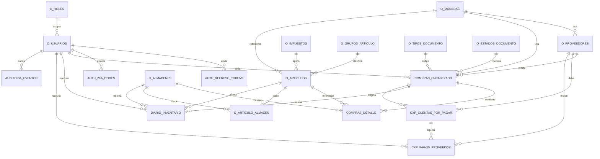

# Diagrama de Base de Datos

El esquema base se tomo de [bd.md](../bd.md). El siguiente diagrama resume las relaciones principales del modelo ERP.

## Tablas Principales

- Seguridad: `o_roles`, `o_usuarios`, `auth_refresh_tokens`, `auth_2fa_codes`
- Catalogos: `o_monedas`, `o_almacenes`, `o_impuestos`, `o_grupos_articulo`, `o_estados_documento`, `o_tipos_documento`
- Maestro: `o_proveedores`, `o_articulos`, `o_articulo_almacen`
- Compras: `compras_encabezado`, `compras_detalle`
- Inventario: `diario_inventario`
- Cuentas por pagar: `cxp_cuentas_por_pagar`, `cxp_pagos_proveedor`
- Auditoria: `auditoria_eventos`

## Implementacion

La definicion SQL base vive en `docker/postgres/init.sql` para levantar el esquema dentro de Docker.
